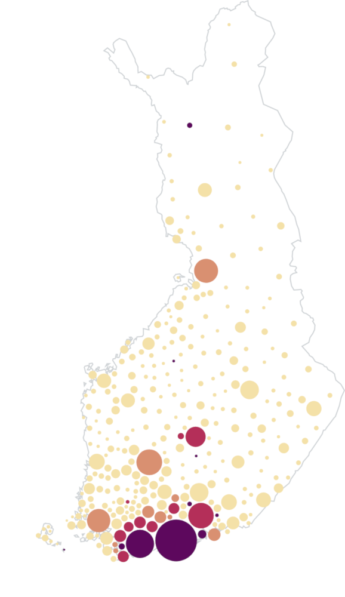
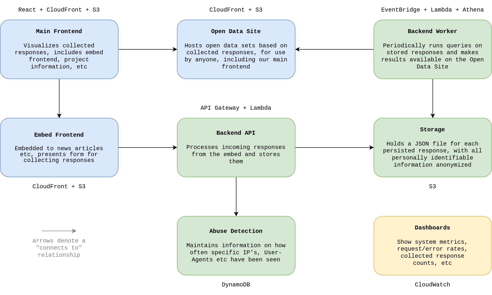

[](https://opensource.org/licenses/MIT)

# Symptomradar/Oiretutka

Symptomradar (Oiretutka in Finnish) is a service by technology company [Futurice](https://futurice.com/) and newspaper [Helsingin Sanomat](https://www.hs.fi/) to crowdsource coronavirus symptoms from the general public.

Crowdsourcing happens by asking questions in an embed that is placed on news media pages. The responses are stored without Personally Identifiable Information (PII). Results are shown in embeds and the main [Oiretutka.fi](https://www.oiretutka.fi/) page.

The project is open source with an MIT license. We encourage media outlets to collaborate within countries to create a service to map the spread of the virus. We welcome all contributors to the project.

## Participation



Following major Finnish news media have participated in data collection:

- [Helsingin Sanomat](https://www.hs.fi/kotimaa/art-2000006452379.html)
- [Ilta-Sanomat](https://www.is.fi/kotimaa/art-2000006459145.html)
- [MTV Uutiset](https://www.mtvuutiset.fi/artikkeli/onko-sinulla-koronan-oireita-osallistu-oiretutkaan-ja-auta-selvittamaan-missa-korona-leviaa/7775832)
- [YLE Uutiset](https://yle.fi/uutiset/3-11298005)

You can also participate by [direct link](https://www.oiretutka.fi/survey).

## Results

Results of the data collection, including interactive visualizations (example on the right) and more information about the project are presented at [Oiretutka.fi](https://www.oiretutka.fi).

## Open data

All data sets both produced and used by the service are made available to the general public on a dedicated [open data site](https://data.oiretutka.fi). Examples of data sets used by Oiretutka are Finnish population and geographic data.

The data is published in a way that makes them readily available for consumption by 3rd parties. For instance, here's a [JSFiddle that pulls the "daily totals" data set from the open data site, and renders a line chart of the relative number of participants suspecting COVID-19 infection, using Highcharts](https://jsfiddle.net/cdw93r7o/). Feel free to create your own.

## Privacy

A number of measures are taken to ensure privacy-preserving data collection, including:

- No analytics are collected from any of the frontends
- The analytics collection of embedding pages (e.g. news articles) can't reach into the `<iframe>` that hosts the data collection
- Web fonts are self-hosted, to prevent snooping by e.g. Google Web Fonts
- The unique ID's of participants are put through a one-way hash function (including a secret salt/pepper component) before being stored
- Potentially personally identifiable meta-data (such as IP-addresses or HTTP headers) are never logged on the backend
- Collected responses are never logged before obfuscation
- Responses collected from postal code areas in Finland known to have low population are merged to neighboring larger postal code areas, to ensure individuals can't be identified that way from collected responses
- The precision of timestamps of when responses were collected is intentionally reduced to make it harder to correlate individual answers with anything else
- Some request meta-data is collected for abuse detection purposes, but they're not stored individually, only in aggregate; see below for more information

For more information, and related legalese, see our [privacy information](https://www.oiretutka.fi/tietosuojalauseke.html) (currently only in Finnish).

## Architecture

The diagram below depicts the major architectural components of the project, and their key technologies.



All infrastructure is [defined in code with Terraform](./infra).

## Contributing

If you find a problem, please open an issue or submit a fix as a pull request.

We welcome new features, but for large changes let's discuss first to make sure the changes can be accepted and integrated smoothly. Discussion should take place in issue dedicated to the new feature.

Feel free to pick an issue and start contributing. For good first issues regarding contributing, see [issues labeled with open sourcing improvements](https://github.com/futurice/symptomradar/labels/open%20sourcing%20improvements).

## Abuse detection

The system includes a privacy-preserving abuse detection/scoring system, which works as follows:

- When a request comes in, we grab its source IP, its `User-Agent` and `X-Forwarded-For`, and call that its "fingerprint"
- Immediately after, we put those values through a one-way hash function, with a secret pepper included, so it can't be reversed
- For each such hashed fingerprint key/value pair, we upsert an item in DynamoDB, e.g. `"2020-03-31T10Z/source_ip/6NehvvOtv6bGjk7FTtutfcozHqX478AVLV1EbcpmV+g=" => 3`
- This means this IP has been seen 3 times within the hour-long time bucket at `2020-03-31T10:xx:yy`
- Each key has a TTL value set up in DynamoDB, so they expire 24 hours after last being written (so the DB doesn't balloon forever)
- We then calculate an "abuse score" for the incoming request, by simply tallying these values over the past 24 hours; e.g. `{ source_ip: 2, user_agent: 5, forwarded_for: -1 }` means we've seen this same IP 2 times during the past 24 hours, the `User-Agent` 5 times, and the `-1` is a special value meaning we didn't get an `X-Forwarded-For` value for this request (so it's pointless to score how common it's recently been)
- This abuse score is stored along with the response
- Later, this score can be used to assess the credibility of each response, during the data dump generation phase

## Contact

To contact the team behind the project, email datadeski@hs.fi.

## Security

If you find a security related issue in our service, please contact datadeski@hs.fi and cert@sanoma.fi, preferred language is English or Finnish.

## Development

### Prerequisites

Project requires Node.js >=12 <13 to be installed; all other dependencies come from NPM via package.json.

You will need Node and npm (npm comes with Node). We recommend [using a node version manager, nvm](https://github.com/nvm-sh/nvm) to install Node, as it allows automatically switching between node versions across projects.

We recommend also installing [direnv](https://direnv.net/), which helps to automatically set environment variables as you switch directories.

### Development environment setup

Clone the project from GitHub (make sure to clone it from the directory you wish to contain your project):

```shell
git clone git@github.com:futurice/symptomradar.git
```

Install NPM dependencies

```shell
cd symptomradar
nvm use
npm i
```

### Environment variables

This application uses a number of environment variables to customize runtime behaviour. The following steps assume that you are using [direnv](https://direnv.net/).

Copy over .envrc.sample into .envrc, at the project root

```shell
cp .envrc.sample .envrc
```

To work with the frontend, you shouldn't need any further variable than the ones already provided.
Follow the instructions inside `.envrc` if you need to set up a mock API endpoint.

### Available NPM tasks

All available run targets can be printed with `npm run`. The main ones for frontend development are:

- `frontend-main-start` runs the React application of Oiretutka
- `frontend-main-build` creates a build for the React application
- `frontend-embed-v1-start` runs the embed of Oiretutka
- `frontend-embed-v1-build` creates a build for the embed

### Release process

- Ensure `dev` has deployed the release you're planning to put out
- [Test that basic data collection works directly](https://dev.oiretutka.fi/embed/v1/) and/or [embedded](https://www.hs.fi/datajournalismi/art-2000006450733.html)
- Take a peek at the `dev` overview dashboard on CloudWatch and make sure everything looks fine
- Run `terraform apply` to ensure there's no unapplied changes
- Release the version pin for `module "env_prod"` in `infra/main.tf` (that is, remove the `?ref=vX.Y` part from the module source string)
- Run `terraform apply` again, and apply any changes to prod (don't do this without knowing what you're doing, though; it's prod infrastructure!)
- Consult the "N commits to master since this release" link in [releases](https://github.com/futurice/symptomradar/releases) and write release notes
- Create the release on GitHub
- Check that the [related action](https://github.com/futurice/symptomradar/actions?query=workflow%3A%22Deploy+PROD%22) completes successfully
- [Test that basic data collection works directly](https://www.oiretutka.fi/embed/v1/) and/or [embedded](https://www.hs.fi/kotimaa/art-2000006452379.html)
- Take a peek at the `prod` overview dashboard on CloudWatch and make sure everything looks fine
- Set the version pin back to `infra/main.tf`, pointing to the newly created release

### Notes on embed development

As said earlier in this document, the data collection happens by asking questions in an embed that is placed on news media pages or articles.

Performance wise, it didn't seem like a good idea to develop the embedded form with a modern JS framework and have all the users who are opening the news articles download extra data, when the form can be implemented using basic HTML and very light-weight (vanilla) JavaScript and JS libraries (jQuery). The JavaScript is typed with TypeScript.

If you have worked previously with modern JS frameworks, these technologies might feel a bit old-fashioned and foreign. If you haven't used vanilla JavaScript in a while or haven't noticed you know vanilla JS, [read and bookmark this cheatsheet](https://htmldom.dev/), [practice JavaScript interactively online](https://learnjavascript.online/) or just [browse extensive JS documentation](https://developer.mozilla.org/en-US/docs/Web/JavaScript). If your jQuery skills are rusty, or you haven't worked with jQuery before, [take a look at jQuery basics](http://jqfundamentals.com/chapter/jquery-basics).

If you haven't worked with TypeScript before, take a look at [the TypeScript Handbook](https://www.typescriptlang.org/docs/handbook/basic-types.html). Mostly TypeScript means that all function parameters and outputs have to be typed. If [the basic types](https://www.typescriptlang.org/docs/handbook/basic-types.html) aren't enough, take a look at [jQuery types](https://github.com/DefinitelyTyped/DefinitelyTyped/tree/682ebb5fcda0d6d68bda36862171cd1f116121b2/types/jquery) too.

Also, as the form is emdedded through an `<iframe>` element, it's a good idea to read [the ultimate guide to iframes](https://blog.logrocket.com/the-ultimate-guide-to-iframes/), it'll give you more context about how the media sites will use this form.

## MIT License

Copyright 2020 Futurice & Helsingin Sanomat

Permission is hereby granted, free of charge, to any person obtaining a copy of this software and associated documentation files (the "Software"), to deal in the Software without restriction, including without limitation the rights to use, copy, modify, merge, publish, distribute, sublicense, and/or sell copies of the Software, and to permit persons to whom the Software is furnished to do so, subject to the following conditions:

The above copyright notice and this permission notice shall be included in all copies or substantial portions of the Software.

THE SOFTWARE IS PROVIDED "AS IS", WITHOUT WARRANTY OF ANY KIND, EXPRESS OR IMPLIED, INCLUDING BUT NOT LIMITED TO THE WARRANTIES OF MERCHANTABILITY, FITNESS FOR A PARTICULAR PURPOSE AND NONINFRINGEMENT. IN NO EVENT SHALL THE AUTHORS OR COPYRIGHT HOLDERS BE LIABLE FOR ANY CLAIM, DAMAGES OR OTHER LIABILITY, WHETHER IN AN ACTION OF CONTRACT, TORT OR OTHERWISE, ARISING FROM, OUT OF OR IN CONNECTION WITH THE SOFTWARE OR THE USE OR OTHER DEALINGS IN THE SOFTWARE.
